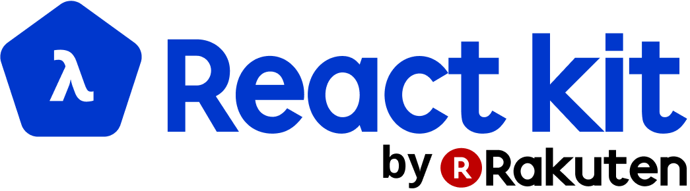

<p align="center">
</p>
<p align="center">Immutable state. Live programming environment. Functional programing concepts </p>
<hr>
<p align="center">
<a href="https://github.com/rakuten-frontend/rakuten-react-kit/wiki">
  
</a>

<a href="https://gitter.im/rakuten-frontend/rakuten-react-kit">
  
</a>

<a href="https://opensource.org/licenses/MIT">
  
</a>
</p>

## Includes

- ⚙️ Functional programing concepts
- 🔬 Clojure atom like state managment
- 🔥 Hot Module Replacement
- 💎 Crystal clean connection between state and UI
- ✨ Super clean webpack
- 🏮 Less ceremony, more fun!

## Local Development
Install dependencies and start the live programing enviroment

```
npm install
npm start
```
a server with HMR (Hot Module Replacement) will start at [localhost:8080](http://localhost:8080)

See more about Hot Module Replacement [here](https://webpack.github.io/docs/hot-module-replacement.html)

## Building for Production

Create minified bundle for deployment in the `build` directory

```
npm run build
```

## Disclaimer
This is an experimental project. Use it in production with caution.

## License

Copyright (c) 2016 Rakuten, Inc. Licensed under the MIT License.
